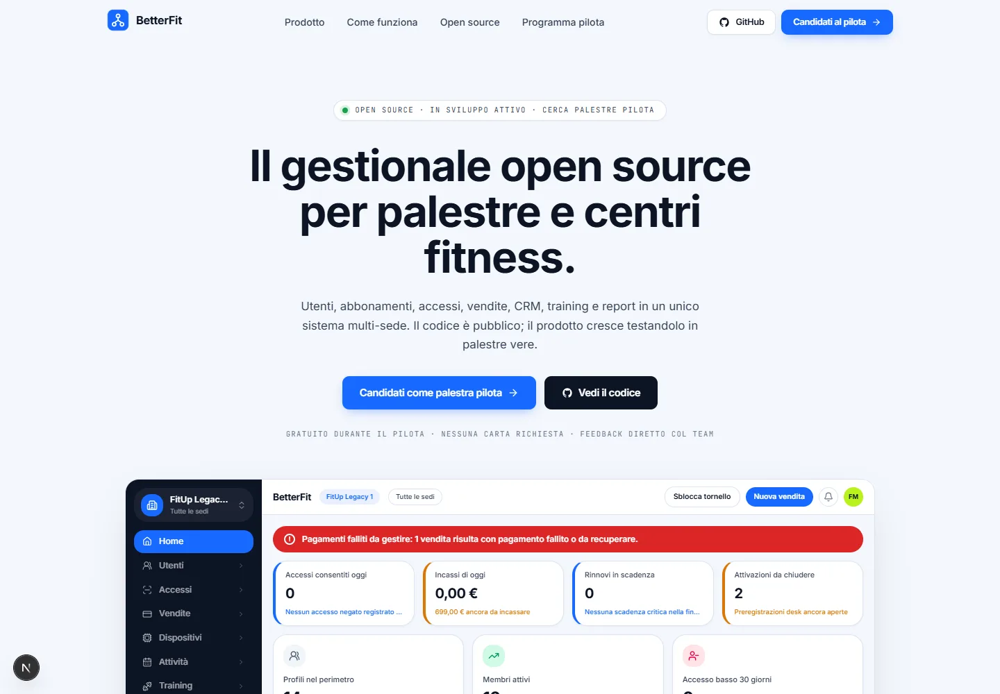

# BetterFit — Landing page

Sito pubblico di [BetterFit](https://github.com/GPOI-2526-5E/BetterFit), il gestionale
open source per palestre e centri fitness. Questa repository contiene **solo la landing
page**; il prodotto (backend .NET + dashboard SvelteKit) vive nel
[repository principale](https://github.com/GPOI-2526-5E/BetterFit).

> **Stato del progetto:** in sviluppo attivo. Il prodotto non è ancora production-ready
> ed è alla ricerca di palestre pilota. La landing riflette solo funzionalità
> effettivamente presenti nel prodotto; i dati mostrati nei mockup provengono dal seed
> di sviluppo (tenant "FitUp").



## Stack

- [Next.js](https://nextjs.org) (App Router, output statico)
- [Tailwind CSS v4](https://tailwindcss.com)
- TypeScript
- Nessuna libreria di animazione: reveal via CSS + `IntersectionObserver`,
  disattivate con `prefers-reduced-motion` e senza JavaScript

La CI (GitHub Actions) esegue lint e build su ogni push e pull request.

## Sviluppo locale

Prerequisiti: Node.js 20+ e [pnpm](https://pnpm.io).

```bash
pnpm install
pnpm dev        # server di sviluppo su http://localhost:3000
```

Altri script:

```bash
pnpm build      # build di produzione
pnpm start      # serve la build di produzione
pnpm lint       # ESLint
```

Non servono variabili d'ambiente: il sito è completamente statico.

## Struttura

```
app/                  # layout, pagina e stili globali (design token del brand)
components/
  landing/            # sezioni della pagina
    product-fragments.tsx   # riproduzioni fedeli delle schermate del prodotto
    lifecycle.tsx           # "il percorso di un iscritto" — sezione principale
    ...
  ui/                 # primitive condivise (Button)
lib/                  # utility e link reali del progetto (lib/utils.ts)
```

I colori, i raggi e le ombre derivano dalla brand guideline del prodotto
(`docs/brand-guideline-betterfit.md` nel repository principale).

## Contribuire

Vedi [CONTRIBUTING.md](CONTRIBUTING.md). Bug e proposte passano dalle
[issue del progetto](https://github.com/GPOI-2526-5E/BetterFit/issues).

## Licenza

**Da definire.** La licenza open source del progetto BetterFit non è ancora stata
scelta: verrà pubblicata nel repository principale e questa repository la adotterà
di conseguenza. Fino ad allora tutti i diritti restano riservati agli autori.
